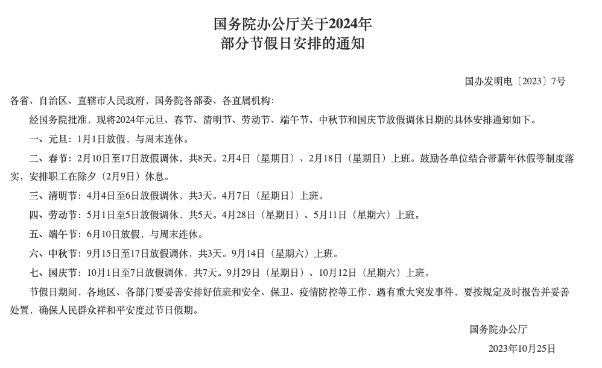

# 项目介绍
本项目可实现解析国务院办公厅关于节假日放假安排的通知。
如果要实现自动解析不同年份的安排，请自行实现页面内容的提取。

# Project Introduction
This project can parse the notices from the State Council General Office regarding holiday arrangements. If you want to automatically parse arrangements for different years, please implement the extraction of page content yourself.

# 国务院假期安排搜索地址
> https://sousuo.www.gov.cn/sousuo/search.shtml?code=17da70961a7&dataTypeId=107&searchWord=国务院办公厅关于2024年部分节假日安排的通知

# 输出内容
| 日期           | 节假日      | 假期类型    |
| -------------- | ----------- | ----------- |
| 2024年1月1日   | 元旦        | 假期        |
| 2024年2月10日  | 春节        | 假期        |
| 2024年2月11日  | 春节        | 假期        |
| 2024年2月12日  | 春节        | 假期        |
| 2024年2月13日  | 春节        | 假期        |
| 2024年2月14日  | 春节        | 假期        |
| 2024年2月15日  | 春节        | 假期        |
| 2024年2月16日  | 春节        | 假期        |
| 2024年2月17日  | 春节        | 假期        |
| 2024年2月4日   | 春节调休    | 非假期      |
| 2024年2月18日  | 春节调休    | 非假期      |
| 2024年4月4日   | 清明节      | 假期        |
| 2024年4月5日   | 清明节      | 假期        |
| 2024年4月6日   | 清明节      | 假期        |
| 2024年4月7日   | 清明节调休  | 非假期      |
| 2024年5月1日   | 劳动节      | 假期        |
| 2024年5月2日   | 劳动节      | 假期        |
| 2024年5月3日   | 劳动节      | 假期        |
| 2024年5月4日   | 劳动节      | 假期        |
| 2024年5月5日   | 劳动节      | 假期        |
| 2024年4月28日  | 劳动节调休  | 非假期      |
| 2024年5月11日  | 劳动节调休  | 非假期      |
| 2024年6月10日  | 端午节      | 假期        |
| 2024年9月15日  | 中秋节      | 假期        |
| 2024年9月16日  | 中秋节      | 假期        |
| 2024年9月17日  | 中秋节      | 假期        |
| 2024年9月14日  | 中秋节调休  | 非假期      |
| 2024年10月1日  | 国庆节      | 假期        |
| 2024年10月2日  | 国庆节      | 假期        |
| 2024年10月3日  | 国庆节      | 假期        |
| 2024年10月4日  | 国庆节      | 假期        |
| 2024年10月5日  | 国庆节      | 假期        |
| 2024年10月6日  | 国庆节      | 假期        |
| 2024年10月7日  | 国庆节      | 假期        |
| 2024年9月29日  | 国庆节调休  | 非假期      |
| 2024年10月12日 | 国庆节调休  | 非假期      |
